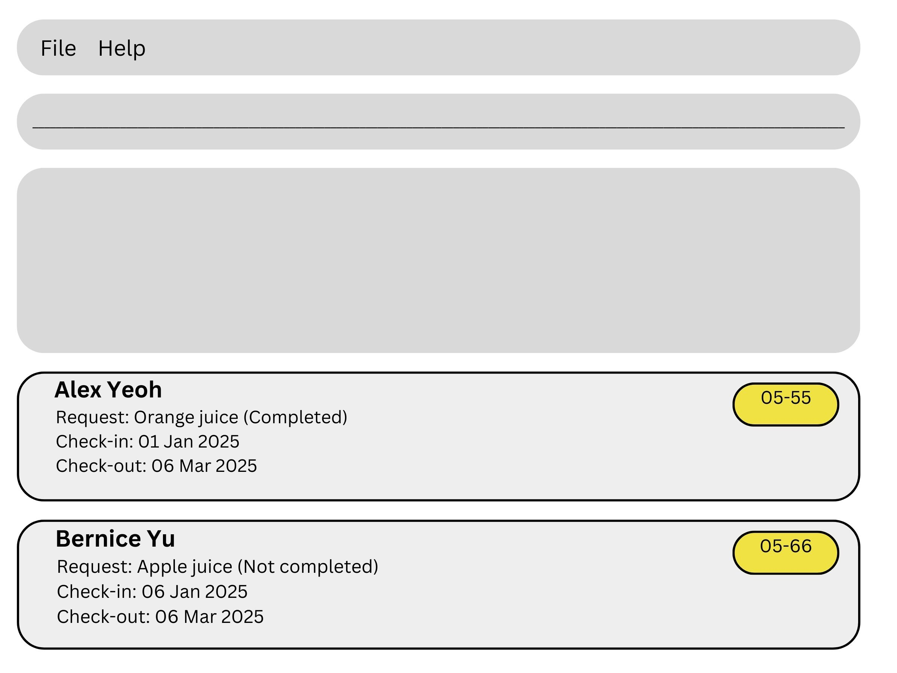

# ***GuestNote***
---
## ***Overview***
---
* This is **GUESTNOTE**. 
GuestNote is a **desktop application for managing hotel guests**, optimized for fast typists. It allows hotel concierges to efficiently handle guest information, track requests, manage check-ins and check-outs using a **command-line interface (CLI)**.

---
## ***Product Scope***
---
### ***Target user***
---
> This product is for a hotel concierge to manage guests’ information who prefer a CLI over a GUI for fast access and easy view of the many guests to keep track of.
---
### **Value Proposition**
---
> Our product will store guests’ information, allowing the concierge to:
> 1. Log requests and preferences in real-time.
> 2. Retrieve relevant guest list and past data. 
> To provide guests with a tailored experience, a home away from home.

---
- This project is based on the AddressBook-Level3 project created by the [SE-EDU initiative](https://se-education.org).
- For the detailed documentation of this project, see the [GuestNote Product Website] (https://github.com/nus-cs2103-AY2425S2/tp/).