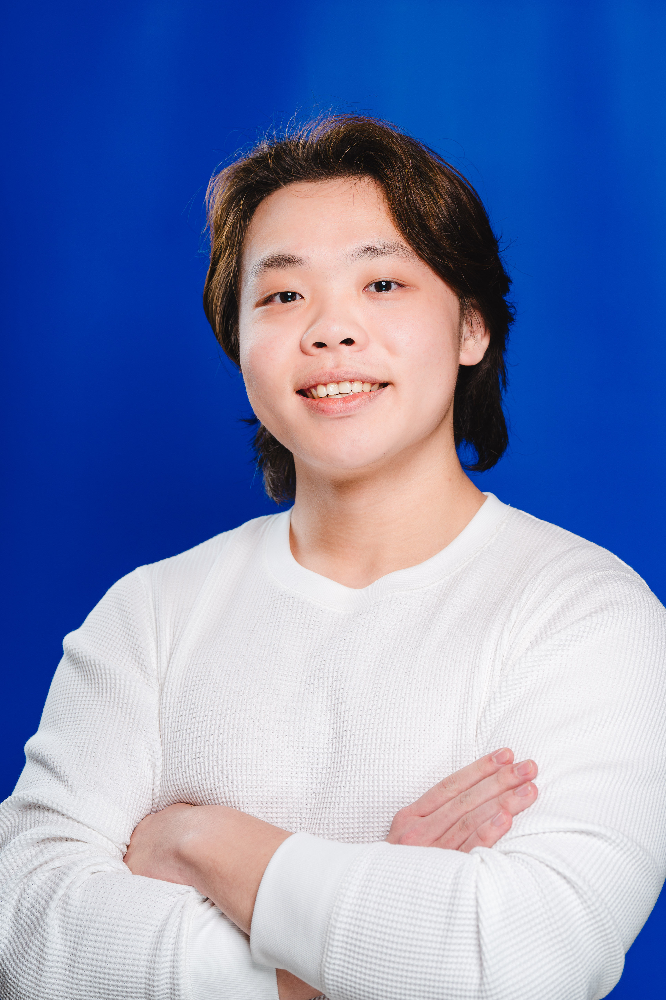
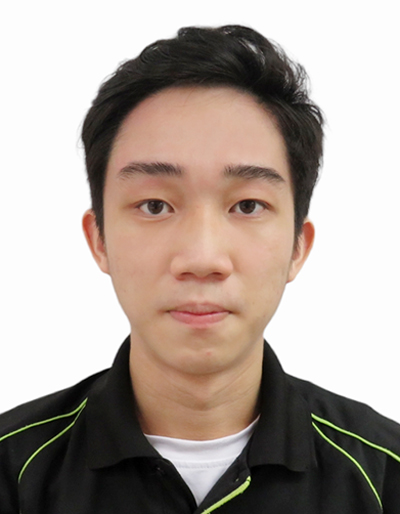
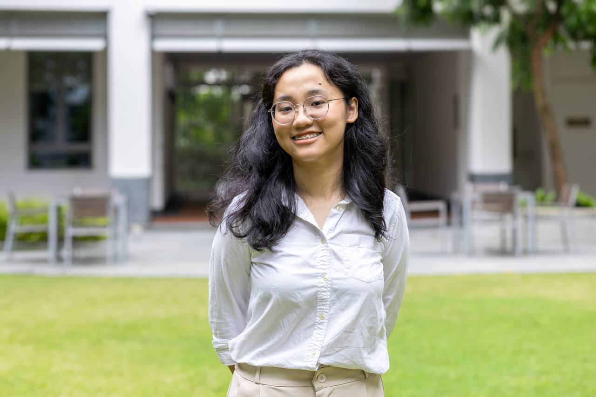

# About Us

We are a team based in the [School of Computing, National University of Singapore](http://www.comp.nus.edu.sg).

You can reach us at the email `lucasloh@u.nus.edu`

## Project team

### W09

### Zhao Zhihao

[[github](http://github.com/Noob-No-1)]
[[portfolio](team/Noob-No-1.md)]

* Role: Team member
* Responsibilities: UI/Backend 

### Shelia Teo Zi Hui

[[github](http://github.com/shelialia)]
[[portfolio](team/shelialia.md)]

* Role: Developer
* Responsibilities: Data

### Ron Quah Kai Yi

[[github](http://github.com/salads-source)]
[[portfolio](team/salads-source.md)]

### Chloe Heng

[[github](http://github.com/juniper285)]
[[portfolio](team/juniper285.md]

* Role: Integration
* Responsibilities: In charge of versioning of the code, maintaining the code repository, integrating various parts of the software to create a whole.

### Lucas Loh

[[github](http://github.com/aekyr)]
[[portfolio](team/aekyr.md)]

* Role: Developer
* Responsibilities: Code Quality
