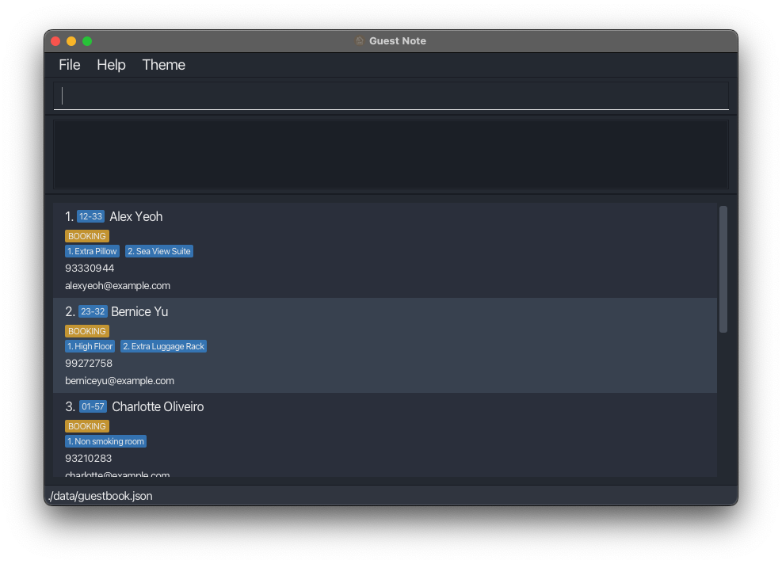
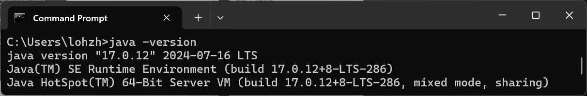
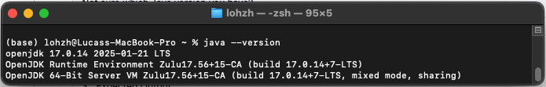
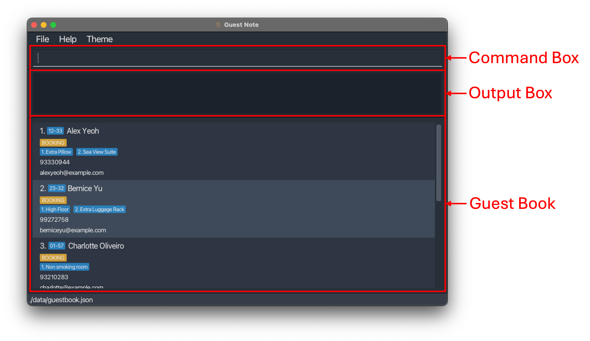
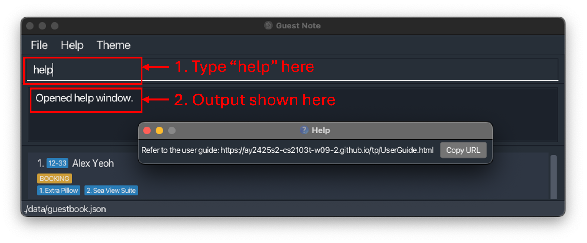

# GuestNote User Guide
**Welcome to GuestNote!**  
> Time is money, and in the hotel industry, every second counts.

Mistakes in guest handling - like assigning the wrong room or forgetting a special request - don’t just hurt your workflow. They hurt your guests’ experience and cost your hotel real money.  

**That’s where GuestNote comes in.**

Adapted from [AddressBook Level 3 (AB3)](#glossary), **GuestNote** takes the core of a reliable contact management system and reimagines it for hotel operations. The result? A lightning-fast desktop app built for concierges and front desk staff, designed for the speed of a [Command-Line Interface (CLI)](#glossary), but with the clarity of a [Graphical User Interface (GUI)](#glossary), when managing hotel guests. Think of it as muscle memory meets modern [User Interface (UI)](#glossary) – if you can type, you can fly.



**Why Choose GuestNote?**  
Designed with the fast-paced world of hotel operations in mind, **GuestNote** helps you: 
- Quickly check in guests and assign rooms with just a few keystrokes 
- View and manage essential guest information at a glance, all in one place 
- Track and organise guest requests using simple, structured commands 
- Reduce costly mistakes through built-in data validation
- Keep track of all guest requests in one place, so nothing gets missed or forgotten

With **GuestNote**, you can stay on top of guest needs, streamline daily concierge tasks, and ensure that no request falls through the cracks. Tailored to your team’s workflow, **GuestNote** simplifies routine processes so you can focus on delivering a smooth and memorable experience for every guest. Spend less time figuring things out and more time focusing on your guests. Provide your guests with a tailored experience, a home away from home.

--------------------------------------------------------------------------------------------------------------------
## Table of Contents
Refer to the sidebar if you are on the website, or to the table below if you are on the PDF.

1. [Quick Start](#quick-start)
2. [Introducing the User Interface](#introducing-the-user-interface)
2. [Features](#features)
3. [FAQ](#faq)
4. [Known Issues](#known-issues)
5. [Command Summary](#command-summary)
6. [Glossary](#glossary)

--------------------------------------------------------------------------------------------------------------------

## How to use our User Guide
Whether you're just getting started or coming back for a refresher, this guide has you covered.  

[New to GuestNote?](#quick-start) You’ll find everything you need in [Quick Start](#quick-start) to hit the ground running. 

[Been here before?](#command-summary) Use our handy [Command Summary](#command-summary) as a quick way to brush up on features.

Visit our online [User Guide](https://ay2425s2-cs2103t-w09-2.github.io/tp/UserGuide.html) for the best (and most updated) experience, or view our [Developer Guide](https://ay2425s2-cs2103t-w09-2.github.io/tp/DeveloperGuide.html) to understand our design principles.

--------------------------------------------------------------------------------------------------------------------

## Quick start

<box type="info">

Hey there! If you are an **advanced user** and you:
* Have Java `17` or above installed in your computer, and
* Already have GuestNote installed in your computer,

Click [here](#features) to view the features of GuestNote.

</box>

#### Installing Java and GuestNote
1. If you already have Java `17` or above installed in your computer, you can skip to step 2.<br>

<box border-left-color="#3c3c3c" icon=":glyphicon-wrench:" light>
<span class="badge bg-secondary" style="font-size:1em">Windows Users: </span>
<b>Installing Java for Windows</b> <br>

* Follow these instructions to download and install Java [here](https://se-education.org/guides/tutorials/javaInstallationWindows.html). { text="1. " }
* To check your Java version on Windows, please follow these steps: { text="2. " }
    * Open Command Prompt. { text="2.1 " }
    * Type `java -version` and press Enter. { text="2.2 " }
    * Check the version of Java installed on your computer. Your Command Prompt window should look like this:  { text="2.3 " }


</box>
<box border-left-color="#3c3c3c" icon=":glyphicon-wrench:" light>
<span class="badge bg-secondary" style="font-size:1em">Mac Users</span>
<b>Installing Java for Mac</b> <br>

* Follow these instructions to download and install Java [here](https://se-education.org/guides/tutorials/javaInstallationMac.html). { text="1. " }
* To check your Java version on Mac, please follow these steps: { text="2. " }
    * Open Terminal. { text="2.1 " }
    * Type `java --version` and press Enter. { text="2.2 " }
    * Check the version of Java installed on your computer. Your Terminal window should look like this: { text="2.3 " }


</box>
<br>

2. Download the latest `.jar` file from [here](https://github.com/AY2425S2-CS2103T-W09-2/tp/releases).

3. Copy the file to the folder you want to use as the _home folder_ for your GuestNote. GuestNote will create all the files it needs in this folder.

#### Running GuestNote

1. Open a command terminal, and use the `cd` command to navigate into the folder you put the jar file in. For example, if you put the jar file in a folder named `GuestNote` on the `Desktop`, you can run the following commands:
    ```bash
    cd Desktop      # Navigate from home directory to the Desktop
    cd GuestNote    # Navigate to the folder containing the jar file
    ```
   
2. Run `java -jar guestnote.jar` command to run the application.<br>
   A GUI should appear in a few seconds. Note how the app contains some sample data.<br>
   

3. If you prefer to explore GuestNote on your own, you may refer to the [Features](#features) below for details of each command. Otherwise, keep reading!

## Introducing the User Interface

**The app is divided into 3 parts:**
1. **Command Box:** This is where you type the commands.
2. **Output Box:** This is where the result of the command is shown.
3. **Guest Book:** This is where the list of guests is shown.


<box type="info" header="##### Try out your first command: `help`" light>

1. Type the command `help` into the Command Box, as shown below, then press Enter. 
2. Now you can always come back to this page if you need help:
 

</box>

<box type="tip" header="##### Try out some other commands: `add`, `list`, `edit`, `check-in`, and `delete`" light>

Some example commands you can try:

<box type="default" icon=":glyphicon-plus:" background-color="#efefef" light>

**Add your first guest:** `add n/John Doe p/91234567 e/johnd@example.com r/01-01`<br>
Adds a guest named !!John Doe!! who lives in room !!#01-01!! with email !!johnd@example.com!! and phone number !!91234567!!.

</box>
<box type="default" icon=":glyphicon-th-list:" background-color="#efefef" light>

**List all guests:** `list`<br>
Shows a list of all guests.

</box>
<box type="default" icon=":glyphicon-edit:" background-color="#efefef" light>

**Edit a guest:** `edit 1 +rq/Room cleaning`<br>
Edits the !!first guest!!, adding an additional request !!Room cleaning!!.

</box>
<box type="default" icon=":glyphicon-log-out:" background-color="#efefef" light>

**Check-in a guest:** `check-in 1`<br>
Checks in the !!first guest!!.

</box>
<box type="default" icon=":glyphicon-trash:" background-color="#efefef" light>

**Delete a guest:** `delete 1`<br>
Deletes the !!first guest!! from the app.

</box>

Want to learn more? Check out the [Features](#features) section below.

</box>
<br>


--------------------------------------------------------------------------------------------------------------------

## Features

#### Table of Contents
* [Format Legend](#format-legend)
* [Viewing help](#viewing-help-help)
* [Adding a guest](#adding-a-guest-add)
* [Listing all guests](#listing-all-guests-list)
* [Editing a guest](#editing-a-guest-edit)
* [Locating guests by name](#locating-guests-by-name-find)
* [Deleting a guest](#deleting-a-guest-delete)
* [Clearing all entries](#clearing-all-entries-clear)
* [Exiting the program](#exiting-the-program-exit)
* [Saving the data](#saving-the-data)
* [Editing the data file](#editing-the-data-file)
* [Check-In a guest](#check-in-a-guest-check-in)
* [Check-Out a guest](#check-out-a-guest-check-out)
* [Extended Find](#extended-find-coming-in-v14)

#### Format Legend
Woah! Before we dive into the features, here's a quick legend to help you understand the format of the commands:

<box type="default" icon=":mif-text-fields:" background-color="#efefef" light>

**UPPER_CASE = !!Fill it in!!**<br>
Words in `UPPER_CASE` are the parameters to be supplied by the user.<br>
**Example:** `n/NAME` :mif-arrow-right-alt: `n/John Doe` :mif-done:

</box>
<box type="default" icon=":mif-data-array:" background-color="#efefef" light>

**[Square Brackets] = !!Optional!!** <br>
Items in square brackets are optional.<br>
**Example:** `n/NAME [rq/REQUEST]`<br>
:mif-arrow-right-alt: `n/John Doe` :mif-done: <br>
:mif-arrow-right-alt: `n/John Doe rq/New Pillow` :mif-done:

</box>
<box type="default" icon=":mif-more-horiz:" background-color="#efefef" light>

**Ellipsis … = !!Multiple Times!!** <br>
Items with `…` after them can be used multiple times including zero times.<br>
**Example:** `[rq/REQUEST]…`<br>
:mif-arrow-right-alt: ` ` (not used at all) :mif-done: <br>
:mif-arrow-right-alt: `rq/New Pillow` :mif-done: <br>
:mif-arrow-right-alt: `rq/New Pillow rq/Orange Juice rq/Socks` :mif-done:
</box>
<box type="warning" icon=":mif-swap-horiz:">

**!!Any Order!!: Parameters can be in any order**<br>
Example: `n/NAME `**`p/PHONE e/EMAIL`**<br>
:mif-arrow-right-alt: `n/NAME `**`p/PHONE e/EMAIL`** (same order) :mif-done: <br>
:mif-arrow-right-alt: **`e/EMAIL`**` n/NAME `**`p/PHONE`** (different order) :mif-done:

</box>
<box type="wrong" icon=":mif-close:">

**!!Copy Carefully!!: Copying across line breaks in PDF version may cause issues**<br>
If you are using a PDF version of this document, be careful when copying and pasting commands that span multiple lines as space characters surrounding line-breaks may be omitted when copied over to the application.

</box>

### Commands


### Viewing help: `help`
--- 
<div style="background-color:#fafafa; padding: 1em; border-radius: 5px; margin-bottom: 1em;">
<box theme="primary" icon=":mif-question-mark:" style="margin-top:-1em; margin-bottom:0px" seamless>

Shows a message with a link to this help page.
</box>
<box theme="warning" icon=":mif-format-italic:" style="margin-top:-1em; margin-bottom:0px" seamless>

Format: `help`
</box>
<box theme="success" icon=":mif-done:"  style="margin-top:-1em; margin-bottom:0em" seamless>

Sample Output:<br>

</box>
</div>
<br>


### Adding a guest: `add`
--- 
<div style="background-color:#fafafa; padding: 1em; border-radius: 5px; margin-bottom: 1em;">
<box theme="primary" icon=":mif-question-mark:" style="margin-top:-1em; margin-bottom:0px" seamless>

Adds a guest to the guest book.
- A guest can have any number of requests (including 0)
- A guest can be added without a phone number
- All guests automatically have status set to 'BOOKED' when they are added.
- Names should only contain alphanumeric characters and spaces.
- Phones should only contain numbers, and be between 4 and 17 digits long.
- Emails should be of the format local-part@domain and adhere to the following constraints:
1. The entire email must not exceed 254 characters.
2. The local-part should only contain alphanumeric characters and these special characters: +, _, ., -. The local-part may not start or end with any special characters.
3. The local-part is followed by a '@' and then a domain name. The domain name is made up of domain labels separated by periods. The domain name must:
    - End with a domain label that is at least 2 characters long.
    - Have each domain label start and end with alphanumeric characters.
    - Have each domain label consist of alphanumeric characters, separated only by hyphens, if any.
- Room numbers should contain two two-digit numbers separated by a hyphen.
- Requests should be alphanumeric, may include spaces, and must not exceed 75 characters.

</box>
<box theme="warning" icon=":mif-format-italic:" style="margin-top:-1em; margin-bottom:0px" seamless>

Format: `add n/NAME e/EMAIL [p/PHONE_NUMBER] r/ROOM_NUMBER [rq/REQUEST]…​`
</box>
<box theme="success" icon=":mif-done:"  style="margin-top:-1em; margin-bottom:0em" seamless>

Sample Input: `add n/David Li e/lidavid@example.com p/98767890 r/21-22 rq/Extra toothpaste` <br>
Adds a new guest named `David Li` who lives in room `21-22` with email `lidavid@example.com` and phone `98767890` and a request `Extra toothpaste`.
</box>
</div>
<br>

### Listing all guests : `list`
--- 
<div style="background-color:#fafafa; padding: 1em; border-radius: 5px; margin-bottom: 1em;">
<box theme="primary" icon=":mif-question-mark:" style="margin-top:-1em; margin-bottom:0px" seamless>

Shows a list of all guests in the guest list.
- The list is sorted by the order in which guests were added.
- An optional filter can be applied to **show only guests with requests**.
- An optional filter can be applied to **show only guests whose names match the filter**.
- The filters are provided for convenience to quickly find guests in the guest list, a stronger search can be done using the [find](#locating-guests-find) command.

</box>
<box theme="warning" icon=":mif-format-italic:" style="margin-top:-1em; margin-bottom:0px" seamless>

Format: `list [rq/] [NAME_FILTER]…`
- **`list`** displays every guest.
- **`list rq/`** displays only guests with requests (i.e. guests whose request field is not null).
- **`list NAME_FILTER…`** displays only guests whose names match the filter.
- **`list rq/ NAME_FILTER…`** displays only guests with requests whose names match the filter.
</box>
<box theme="success" icon=":mif-done:"  style="margin-top:-1em; margin-bottom:0em" seamless>

Sample Input: `list` <br>
Shows a list of all guests in the guest list.
</box>
<box theme="success" icon=":mif-done:"  style="margin-top:-1em; margin-bottom:0em" seamless>

Sample Input: `list rq/` <br>
Shows a list of all guests in the guest list with requests.
</box>
<box theme="success" icon=":mif-done:"  style="margin-top:-1em; margin-bottom:0em" seamless>

Sample Input: `list John` <br>
Shows a list of all guests with `John` in their name, including `John Doe` and `Johnathon Chua`.
</box>
<box theme="success" icon=":mif-done:"  style="margin-top:-1em; margin-bottom:0em" seamless>

Sample Input: `list rq/ John Alex` <br>
Shows a list of all guests with requests, with either `John` or `Alex` in their name, including `John Doe` and `Alexander Chua`.
</box>
</div>
<br>

### Locating guests: `find`
--- 
<div style="background-color:#fafafa; padding: 1em; border-radius: 5px; margin-bottom: 1em;">
<box theme="primary" icon=":mif-question-mark:" style="margin-top:-1em; margin-bottom:0px" seamless>

The `find` command now searches across all guest fields by default—including name, email, phone number, room number, and requests. Use this command to search for a keyword that may appear in any field.
* At least one keyword must be provided.
* The search is case-insensitive (e.g. `john` matches `John`).
* Only full words are matched. For example, `Han` will not match `Hans`.
* The search is performed across all guest fields (name, phone number, room number, and requests).
* Guests matching at least one keyword will be returned (i.e. an OR search).

</box>
<box theme="warning" icon=":mif-warning:" style="margin-top:-1em; margin-bottom:0px" seamless>

**Warning:**
- Avoid using overly generic or very short keywords, as these may produce unintended matches.
- Because the command uses an OR search across all fields, multiple keywords can broaden your search results more than expected.
</box>
<box theme="warning" icon=":mif-format-italic:" style="margin-top:-1em; margin-bottom:0px" seamless>

Format: `find KEYWORD [MORE_KEYWORDS]…`
</box>
<box theme="success" icon=":mif-done:"  style="margin-top:-1em; margin-bottom:0em" seamless>

Sample Input: `find John` <br>
Shows a list where any field (e.g. email, name) contains the full word "John" (e.g. "John Doe").
</box>
<box theme="success" icon=":mif-done:"  style="margin-top:-1em; margin-bottom:0em" seamless>

Sample Input: `find BOOKED` <br>
Shows all guests with the status `BOOKED`. You can also apply this for other statuses like `CHECKED IN` or `CHECKED OUT`, however you will need to use `find CHECKED_IN` and `find CHECKED_OUT` instead. 
</box>
<box theme="success" icon=":mif-done:"  style="margin-top:-1em; margin-bottom:0em" seamless>

Sample Input: `find 03-04` <br>
Shows all guests where any field (e.g. email, name) contains the full word "03-04" (e.g. "03-04"). This is useful for looking up the guests in a specific room. Note that the `#` symbol is not required.
</box>

</div>
<br>


### Editing a guest: `edit`
--- 
<div style="background-color:#fafafa; padding: 1em; border-radius: 5px; margin-bottom: 1em;">
<box theme="primary" icon=":mif-question-mark:" style="margin-top:-1em; margin-bottom:0px" seamless>

Edits an existing guest in the guest list.
* Edits the guest at the specified `INDEX`. The index refers to the index number shown in the displayed guest list. The index **must be a positive integer and must be valid** (ie. within the number of guests displayed).
* At least one of the optional fields must be provided.
* Existing values will be updated to the input values.
* If the edit results in a duplicate guest in the guest list (ie. two with the same email address), the command is not allowed.

</box>
<box theme="warning" icon=":mif-format-italic:" style="margin-top:-1em; margin-bottom:0px" seamless>

Format: `edit INDEX [n/NAME] [p/PHONE_NUMBER] [e/EMAIL] [r/ROOM_NUMBER]`
</box>
<box theme="success" icon=":mif-done:"  style="margin-top:-1em; margin-bottom:0em" seamless>

Sample Input: `edit 1 e/charlotte@example.com`<br>
Changes the email for the first guest to `charlotte@example.com`
</box>
<box theme="success" icon=":mif-done:"  style="margin-top:-1em; margin-bottom:0em" seamless>

Sample Input: `edit 2 p/91234567 r/01-03` <br>
Changes the phone number for the second guest to `91234567` and the room number to `01-03`.
</box>
<box theme="danger" icon=":mif-close:"  style="margin-top:-1em; margin-bottom:0em" seamless>

Sample Input: `edit 1 e/an_email_already_in_use@example.com r/03-04` <br>
Tries to change a guest's email to one that is already registered to another guest, and update the room number. Nothing will occur, and an error message will be shown explaining that the email is not valid.

</box>
</div>
<br>

### Adding a request to a guest: `edit INDEX +rq/REQUEST`
--- 
<div style="background-color:#fafafa; padding: 1em; border-radius: 5px; margin-bottom: 1em;">
<box theme="primary" icon=":mif-question-mark:" style="margin-top:-1em; margin-bottom:0px" seamless>

Adds a request to an existing guest in the guest list.
* Request names should be alphanumeric, may include spaces, and must not exceed 75 characters
* Conditions and features described in the previous section on [edit](#editing-a-guest-edit) command apply.
* The new request will be **added** to the back of the current request list for the guest.

</box>
<box theme="warning" icon=":mif-format-italic:" style="margin-top:-1em; margin-bottom:0px" seamless>

Format: `edit INDEX [+rq/REQUEST]…​`
</box>
<box theme="success" icon=":mif-done:"  style="margin-top:-1em; margin-bottom:0em" seamless>

Sample Input: `edit 2 +rq/Extra blanket`  <br>
Edits guest No.2 in the list by adding a request `Extra blanket`.
</box>
<box theme="success" icon=":mif-done:"  style="margin-top:-1em; margin-bottom:0em" seamless>

Sample Input: `edit 2 +rq/Extra blanket +rq/Extra pillow`  <br>
Edits guest No.2 in the list by adding two requests `Extra blanket` and `Extra pillow`.
</box>
</div>
<br>

### Removing a request of a guest: `edit INDEX -rq/REQUEST`
--- 
<div style="background-color:#fafafa; padding: 1em; border-radius: 5px; margin-bottom: 1em;">
<box theme="primary" icon=":mif-question-mark:" style="margin-top:-1em; margin-bottom:0px" seamless>

Removes an existing request of an existing guest in the guest list.
* Conditions and features described in the previous section on [edit](#editing-a-guest-edit) command apply.
* The request will be **removed** from the list of requests for the guest.
* If the request is not found in the list of requests for the guest, nothing will happen and an error message will be shown.

</box>
<box theme="warning" icon=":mif-format-italic:" style="margin-top:-1em; margin-bottom:0px" seamless>

Format: `edit … [-rq/REQUEST]…​`
</box>
<box theme="warning" icon=":mif-warning:" style="margin-top:-1em; margin-bottom:0px" seamless>

`-ri/REQUEST_INDEX` and `-rq/REQUEST` cannot be used together in the same edit command. <br>
</box>
<box theme="success" icon=":mif-done:"  style="margin-top:-1em; margin-bottom:0em" seamless>

Sample Input: `edit 2 -rq/Extra blanket`  <br>
Edits guest No.2 in the list by removing the request `Extra blanket`.
</box>
<box theme="success" icon=":mif-done:"  style="margin-top:-1em; margin-bottom:0em" seamless>

Sample Input: `edit 2 -rq/Extra blanket -rq/Extra pillow`  <br>
Edits guest No.2 in the list by removing two requests `Extra blanket` and `Extra pillow`.
</box>
<box theme="danger" icon=":mif-close:"  style="margin-top:-1em; margin-bottom:0em" seamless>

Sample Input: `edit 2 -ri/1 -rq/Extra Towel`  <br>
Tries to remove the first request and a request `Extra Towel` in the list of requests for that guest.

The above command is not allowed as the requests deleted can be different depending on how the command is interpreted.
**To prevent confusion, nothing will occur, and an error message will be shown.**
</box>
</div>
<br>

### Removing a request by index: `edit … -ri/REQUEST_INDEX `
--- 
<div style="background-color:#fafafa; padding: 1em; border-radius: 5px; margin-bottom: 1em;">
<box theme="primary" icon=":mif-question-mark:" style="margin-top:-1em; margin-bottom:0px" seamless>

**Removes** an existing request **using the index of the request** of an existing guest in the guest list.
* Conditions and features described in the previous section on [edit](#editing-a-guest-edit) command apply.
* The request at the **specified index** will be **removed** from the list of requests for the guest.
* Rules on specified index are the same as the rules for the [edit](#editing-a-guest-edit) command.

</box>
<box theme="warning" icon=":mif-format-italic:" style="margin-top:-1em; margin-bottom:0px" seamless>

Format: `edit … [-ri/REQUEST_INDEX]​`
</box>
<box theme="warning" icon=":mif-warning:" style="margin-top:-1em; margin-bottom:0px" seamless>

`-ri/REQUEST_INDEX` and `-rq/REQUEST` cannot be used together in the same edit command. <br>
</box>
<box theme="success" icon=":mif-done:"  style="margin-top:-1em; margin-bottom:0em" seamless>

Sample Input: `edit 2 -ri/1`  <br>
Edits guest No.2 in the list by removing the first request in the list of requests for that guest.
</box>
<box theme="danger" icon=":mif-close:"  style="margin-top:-1em; margin-bottom:0em" seamless>

Sample Input: `edit 2 -ri/1 -ri/2`  <br>
Tries to remove the first and second requests in the list of requests for that guest. The above command is not allowed as the requests deleted can be different depending on how the command is interpreted. **To prevent confusion, nothing will occur, and an error message will be shown.**
</box>
</div>
<br>

### Checking In a guest: `check-in` 
--- 
<div style="background-color:#fafafa; padding: 1em; border-radius: 5px; margin-bottom: 1em;">
<box theme="primary" icon=":mif-question-mark:" style="margin-top:-1em; margin-bottom:0px" seamless>

Changes the status of the guest at the specified index to `CHECKED IN`.
* If the guest is already checked-in, the command will not have any effect and an error will be shown.
* Rules on specified index are the same as the rules for the [edit](#editing-a-guest-edit) command.

</box>
<box theme="warning" icon=":mif-format-italic:" style="margin-top:-1em; margin-bottom:0px" seamless>

Format: `check-in INDEX`
</box>
<box theme="success" icon=":mif-done:"  style="margin-top:-1em; margin-bottom:0em" seamless>

Sample Input: `check-in 1`  <br>
Changes the status of the guest at index 1 to `CHECKED IN`.
</box>
</div>
<br>

### Checking Out a guest: `check-out`
--- 
<div style="background-color:#fafafa; padding: 1em; border-radius: 5px; margin-bottom: 1em;">
<box theme="primary" icon=":mif-question-mark:" style="margin-top:-1em; margin-bottom:0px" seamless>

Changes the status of the guest at the specified index to `CHECKED OUT`.
* !!The guest must have a status of checked-in before they can be checked-out!!. Otherwise, the command will not have any effect and an error will be shown.
* If the guest is already checked-out, the command will not have any effect and an error will be shown.
* Rules on specified index are the same as the rules for the [edit](#editing-a-guest-edit) command.

</box>
<box theme="warning" icon=":mif-format-italic:" style="margin-top:-1em; margin-bottom:0px" seamless>

Format: `check-out INDEX`
</box>
<box theme="success" icon=":mif-done:"  style="margin-top:-1em; margin-bottom:0em" seamless>

Sample Input: `check-out 1`  <br>
Changes the status of the guest at index 1 to `CHECKED OUT`.
</box>
</div>
<br>

### Deleting a guest : `delete`
--- 
<div style="background-color:#fafafa; padding: 1em; border-radius: 5px; margin-bottom: 1em;">
<box theme="primary" icon=":mif-question-mark:" style="margin-top:-1em; margin-bottom:0px" seamless>

Deletes the specified guest from the guest list.
* The index refers to the index number shown in the displayed guest list.
* Rules on specified index are the same as the rules for the [edit](#editing-a-guest-edit) command.

</box>
<box theme="warning" icon=":mif-format-italic:" style="margin-top:-1em; margin-bottom:0px" seamless>

Format: `delete INDEX`
</box>
<box theme="success" icon=":mif-done:"  style="margin-top:-1em; margin-bottom:0em" seamless>

Sample Input: `delete 2` <br>
Deletes the second guest in the guest list.
</box>

</div>
<br>

### Clearing all entries : `clear`
--- 
<div style="background-color:#fafafa; padding: 1em; border-radius: 5px; margin-bottom: 1em;">
<box theme="primary" icon=":mif-question-mark:" style="margin-top:-1em; margin-bottom:0px" seamless>

Deletes all guests in the guest list.
* This command is provided for convenience to clear the mock data in the app.
* It is not recommended to use this command as it will delete all guests in the guest list.

</box>
<box theme="warning" icon=":mif-format-italic:" style="margin-top:-1em; margin-bottom:0px" seamless>

Format: `clear`
</box>

</div>
<br>

### Exiting the program : `exit`
--- 
<div style="background-color:#fafafa; padding: 1em; border-radius: 5px; margin-bottom: 1em;">
<box theme="primary" icon=":mif-question-mark:" style="margin-top:-1em; margin-bottom:0px" seamless>

Exits the program. 
- This is provided for convenience to quick typists, closing the app without using the mouse. 
- It is not necessary to use this command to exit the app.
</box>
<box theme="warning" icon=":mif-format-italic:" style="margin-top:-1em; margin-bottom:0px" seamless>

Format: `exit`
</box>
</div>
<br>

### Notes on the data file
---
<div style="background-color:#fafafa; padding: 1em; border-radius: 5px; margin-bottom: 1em;">
<box theme="success" icon=":mif-done:" style="margin-top:-1em; margin-bottom:0px" seamless>
Any changes to the data are immediately saved to the data file. **There is no need to save manually.**
</box>
<box theme="primary" icon=":mif-question-mark:" style="margin-top:-1em; margin-bottom:0px" seamless>

The data file is stored in the home folder of GuestNote, where you placed the GuestNote jar file.
- The data file is named `guestnote.json` and is created automatically when you run the application for the first time.
- The data file is used to store all the guest information in JSON format, which is a standard format for storing data in a structured way.

</box>
<box theme="warning" icon=":mif-warning:" style="margin-top:-1em; margin-bottom:0px" seamless>

**Caution:** Advanced users are welcome to update data directly by editing that data file, however, please note:
- If your changes to the data file makes its format invalid, GuestNote will discard all data and start with an empty data file at the next run.  Hence, **it is recommended to take a backup of the file before editing it**.<br>
- Furthermore, certain edits can cause the GuestNote to behave in unexpected ways (e.g., if a value entered is outside the acceptable range). Therefore, **edit the data file only if you are confident** that you can update it correctly.
</box>
</div>

--------------------------------------------------------------------------------------------------------------------

## FAQ

**Q**: How do I transfer my data to another Computer?<br>
**A**: Install the app in the other computer and overwrite the empty data file it creates with the file that contains the data of your previous GuestNote home folder.

**Q**: What should I do if the app crashes or behaves unexpectedly?<br>
**A**: Ensure you are using the correct version of Java as specified in the Quick Start section. If the issue persists, check the log files for any error messages and report them to the support team.

**Q**: Can I use GuestNote on multiple computers simultaneously?<br>
**A**: GuestNote is designed to be used on a single computer. Using it on multiple computers simultaneously may lead to data inconsistencies.

--------------------------------------------------------------------------------------------------------------------

## Known issues

1. **When using multiple screens**, if you move the application to a secondary screen, and later switch to using only the primary screen, the GUI will open off-screen. The remedy is to delete the `preferences.json` file created by the application before running the application again.
2. **If you minimise the Help Window** and then run the `help` command (or use the `Help` menu, or the keyboard shortcut `F1`) again, the original Help Window will remain minimised, and no new Help Window will appear. The remedy is to manually restore the minimised Help Window.
3. **Slow performance on large guest lists**, if the guest list contains a large number of entries, the application may experience slow performance. The remedy is to periodically clear out old or unnecessary entries.


--------------------------------------------------------------------------------------------------------------------

## Command summary

Action     | Format, Examples
-----------|----------------------------------------------------------------------------------------------------------------------------------------------------------------------
**Add**    | `add n/NAME p/PHONE_NUMBER e/EMAIL r/ROOM_NUMBER [rq/REQUEST]…​` <br> e.g., `add n/James Ho p/22224444 e/jamesho@example.com r/01-01 rq/Add Pillow rq/Orange Juice`
**Check-In** | `check-in INDEX`<br> e.g., `check-in 1`
**Check-Out** | `check-out INDEX`<br> e.g., `check-out 1`
**Clear**  | `clear`
**Delete** | `delete INDEX`<br> e.g., `delete 3`
**Edit**   | `edit INDEX [n/NAME] [p/PHONE_NUMBER] [e/EMAIL] [+rq/REQUEST]… [-rq/REQUEST]… [-ri/REQUEST]​`<br> e.g.,`edit 2 n/James Lee e/jameslee@example.com`
**Exit**   | `exit`
**Find**   | `find KEYWORD [MORE_KEYWORDS]`<br> e.g., `find James Jake`
**Help**   | `help`
**List**   | `list`

--------------------------------------------------------------------------------------------------------------------
## Glossary
### **Glossary**
___

| **Term**                     | **Definition / Example**                                                                                                                                   |
|-----------------------------|------------------------------------------------------------------------------------------------------------------------------------------------------------|
| **AddressBook Level 3 (AB3)** | The original open-source Java application from which GuestNote was adapted. AB3 serves as a contact management app with a CLI interface and basic CRUD functionality, forming the foundation for GuestNote’s structure and features. |
| **Backup**                  | A saved copy of your data file, used to restore the AddressBook in case of data loss.                                                                      |
| **cd**                      | Stands for "change directory" – a terminal command used to navigate between folders.<br>e.g., `cd path/to/folder`                                          |
| **Check-in**                | The process of registering a guest’s arrival at the hotel.                                                                                                  |
| **Check-out**               | The process of finalising a guest’s stay and removing their active record.                                                                                 |
| **CLI (Command Line Interface)** | A text-based interface for interacting with software by typing commands, instead of using a graphical interface. Common in developer tools and command-based apps like GuestNote. |
| **Command**                 | An instruction typed into the CLI to perform an action in GuestNote.<br>e.g., `add`, `edit`, `check-in`                                                    |
| **CSV (Comma Separated Values)** | A file format used for tabular data, where values are separated by commas and records by newlines. Can be opened by spreadsheet software like Excel.     |
| **Guest**                   | A guest staying at the hotel whose information is stored in the **GuestNote** system.                                                                      |
| **GuestNote**               | The system responsible for managing hotel guest records, including personal details, requests, and check-in/check-out data.                                |
| **GUI (Graphical User Interface)** | A visual interface that allows users to interact with GuestNote using elements like buttons, lists, and panels.                                      |
| **Home Folder**             | The folder on your computer where GuestNote stores its data files.                                                                                         |
| **Index**                   | A number representing the position of a guest in the list.<br>e.g., in `delete 2`, "2" is the index of the guest to be deleted.                            |
| **JSON (JavaScript Object Notation)** | A lightweight data-interchange format that is easy to read and write. GuestNote uses JSON to store its internal data files.                      |
| **JSON File Location**      | The path to the JSON data file used by GuestNote.<br>e.g., `/home/user/data/guestnote.json`                                                                |
| **Mainstream OS**           | Refers to common operating systems supported by GuestNote: **Windows**, **Linux**, **Unix**, and **MacOS**.                                                |
| **Parameter**               | A specific input provided with a command, usually in the form of a prefix and value.<br>e.g., `n/James` or `r/01-01`                                       |
| **Request**                 | A service or action requested by a guest (e.g., room service, maintenance, additional amenities).                                                           |
| **Status**                  | Indicates the guest's booking stage:<br>**BOOKED**, **Checked-In** (`check-in INDEX`), or **Checked-Out** (`check-out INDEX`)                             |
| **UI (User Interface)**     | The overall layout and design of how users interact with GuestNote, including both CLI and GUI elements.                                                   |
